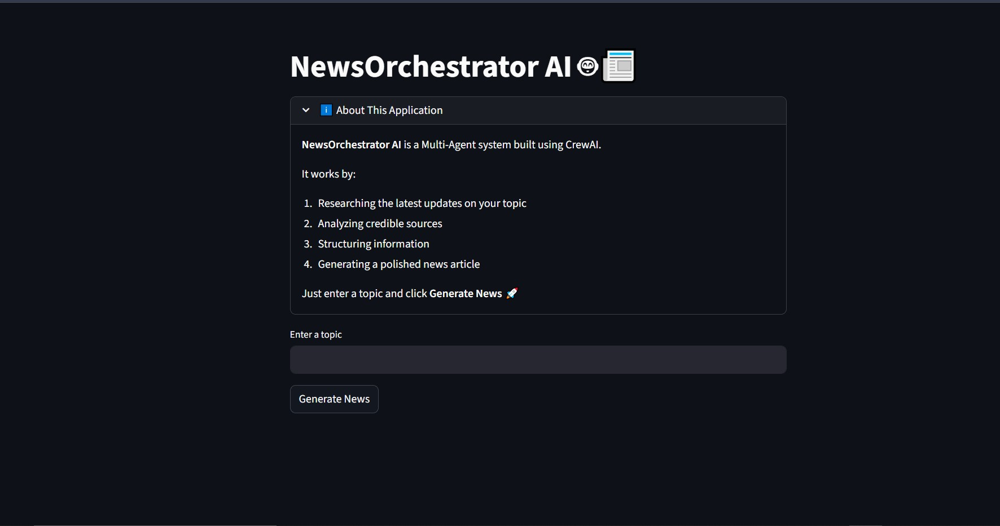

# NewsOrchestrator AI 🤖📰 
## A Multi-Agent AI News Generation System

### 🧠 Overview

This project implements a production-style multi-agent AI system using CrewAI and Google Gemini 1.5 Flash that autonomously researches and generates structured blog articles on emerging trends.

The system simulates collaborative teamwork between AI agents:

🔎 Research Agent – Gathers real-time insights using web search tools

✍️ Writer Agent – Synthesizes research into a structured, engaging article

Unlike many LLM-based projects that rely on expensive APIs, this system is built using free-tier APIs, demonstrating a cost-efficient and scalable AI architecture design.

## 🖥️ Application Preview

### Home Screen

### Generation in Progress

### Generated Output

### Workflow Type: Sequential Agent Orchestration

Task 1 → Research & analysis

Task 2 → Content generation

Output saved as .md file

### 🤖 Agents

### 🔎 Research Agent

#### Role: Senior Technology Researcher

##### Capabilities:

- Real-time web search

- Trend identification

- Market risk analysis

- Memory-enabled

- Delegation allowed

### ✍️ Writer Agent

#### Role: Professional Tech Journalist

##### Capabilities:

- Structured narrative writing

- Markdown formatting

- Clear industry-focused explanations

- Independent task execution

